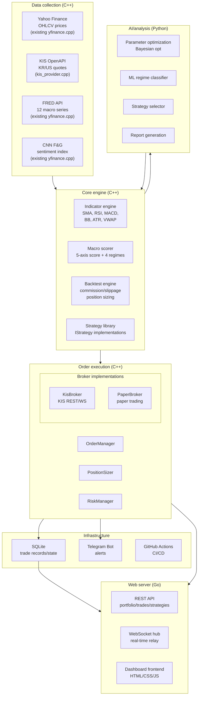

# kairos Project Plan (v1.0, finalized)

> **Project**: kairos
> **Location**: `/home/hslee/workspace/kairos`
> **Goal**: A quant-driven automated trading system for the Korean and US equity markets
> **Finalized**: 2026-09-13

> [!NOTE]
> **Implementation status (updated 2026-09-19).** This document is the original plan as
> written on 2026-09-13; the phase bodies below are left as authored. What has actually
> shipped since then:
> - **Phase 1-B, 1-C, 1-D — done.** Backtests model commission/slippage/stop-loss; 25
>   indicators; KIS daily data with pagination past the ~100-bar-per-call cap.
> - **Phase 2 — partially done, but not as designed.** There is no `IBroker` abstraction
>   yet. Instead `KisTrader` (`include/broker/kis_trader.hpp`) talks to KIS directly for
>   cash orders and balance inquiry. Two executables drive it: `trader` (daily bars,
>   one run per day) and `trader` (minute-bar loop), both going through
>   `trade::SignalExecutor` for sizing, stop-loss and journaling.
>   `OrderManager` / `PositionSizer` / `RiskManager` do not exist; position state is read
>   back from KIS on every cycle instead of being tracked locally. Every decision is
>   appended to `data/trades.jsonl` by `trade::TradeJournal`, and
>   `kis_order fills` syncs KIS's own fill history back into it.
> - **Phase 2 risk/ops layer — done, outside the original design.** `trade::RiskGuard`
>   enforces a per-day loss limit and order cap from the config's `risk` block
>   (state in `data/risk_state.json`, sells never blocked); `data::KrxCalendar`
>   skips KRX holidays from `config/krx_holidays.json`, since KIS's holiday API
>   (`CTCA0903R`) is rejected on paper accounts; `deploy/systemd/` +
>   `scripts/install_systemd.sh` run the whole thing unattended, in dry-run until
>   `--live` is added by hand.
> - **Phase 3 — partially done, but not as designed.** No Go server. The dashboard is
>   `scripts/dashboard_server.py` (local Python) plus `docs/index.html`, fed by
>   `portfolio_report`. Telegram alerts are implemented (`notify::Telegram`, live
>   orders and risk blocks only) but **unconfigured** — `.env` has empty
>   `TELEGRAM_*` keys. External access (3-D) is still open.
> - **Phase 1-A (tests) — done, not with GTest.** `tests/` holds 78 cases run by
>   `kairos_tests` and `ctest`, built by default, using a small in-tree framework
>   rather than GTest (not installed here, and not worth a third dependency). The
>   suite found five real bugs on its first run, including look-ahead in the
>   Bollinger and MACD strategies.
> - **Phase 4, Phase 5 — not started.**
>
> Treat the phase bodies as intent, not as a description of the current code. `README.md`
> describes what exists today.

---

## 1. Technology decisions

| Item | Decision | Notes |
|------|------|------|
| **Core engine language** | C++ (keep) | Backtests, indicator math, strategy logic — the performance-sensitive parts |
| **Secondary language** | Python | Data analysis, strategy prototyping, ML/AI, utility scripts |
| **Server/web** | Go | REST API server, dashboard backend, WebSocket proxy |
| **Long-term candidate** | Rust | Possible incremental migration for performance-critical modules |
| **KR broker** | Korea Investment & Securities (KIS) OpenAPI | Covers both KR and US markets, with full paper-trading support |
| **US broker** | KIS (overseas stock API) | Same infrastructure covers US; IBKR/Alpaca possible later |
| **DB (phases 1–3)** | SQLite | Local trade records and portfolio state |
| **DB (phase 5)** | PostgreSQL | Migration target when going multi-tenant |
| **Alerts** | Telegram Bot | Best fit for personal use; Slack/Discord later |
| **CI/CD** | GitHub Actions (keep + extend) | Test automation, dashboard deployment |

---

## 2. Codebase analysis (as of 2026-09-13)

### 2.1 Architecture at the time
```
kairos/                    # C++17, CMake + Ninja
├── include/                    # Headers
│   ├── yfinance.hpp            # Static API client (Yahoo, FRED, CNN F&G)
│   ├── indicator.hpp           # Technical indicators (SMA, RSI) — header-only
│   ├── stock_info.hpp          # StockInfo struct (OHLCV time series)
│   ├── fng_info.hpp            # FearAndGreedInfo struct
│   ├── fred_info.hpp           # FredSeriesInfo struct
│   ├── macro_scorer.hpp        # 5-axis macro score + 4-regime classification
│   ├── strategy/istrategy.hpp  # IStrategy pure virtual interface
│   ├── backtest/backtest_engine.hpp  # Single-ticker backtest engine
│   └── macro/macro_backtester.hpp    # Portfolio backtest engine
├── src/                        # Implementations
│   ├── yfinance.cpp            # libcurl + nlohmann/json API calls
│   ├── backtest/backtest_engine.cpp
│   └── macro/
│       ├── macro_backtester.cpp
│       └── macro_scorer.cpp
├── lib/                        # Strategy implementations
│   ├── rsi/                    # RSI(14, 30/70) strategy
│   └── sma_crossover/          # SMA(20/50) golden/death cross strategy
├── app/                        # CLI executables (9)
├── config/                     # JSON config (macro weights, strategy profiles)
├── docs/                       # API docs + GitHub Pages dashboard
└── .github/workflows/          # Daily macro report CI
```

### 2.2 Core interfaces (at the time)

#### IStrategy
```cpp
enum class Signal { BUY, SELL, HOLD };

struct IStrategy {
    virtual ~IStrategy() = default;
    [[nodiscard]] virtual std::string name() const = 0;
    virtual void init(const StockInfo& data) = 0;
    [[nodiscard]] virtual std::size_t warmupPeriod() const = 0;
    [[nodiscard]] virtual Signal evaluate(const StockInfo& data, std::size_t index) = 0;
};
```

#### BacktestEngine
```cpp
class BacktestEngine {
public:
    explicit BacktestEngine(double initialCapital = 10000.0);
    [[nodiscard]] BacktestResult run(IStrategy& strategy, const StockInfo& data);
};
// BacktestResult: ticker, totalReturnPct, winRate, maxDrawdownPct, sharpeRatio, score(0~100), trades[]
```

#### Strategy registration
- **Then**: static linking (sources listed explicitly in CMakeLists.txt)
- Adding a strategy: create `lib/<name>/`, then register manually in the root and app CMakeLists.txt

---

## 3. Target directory layout

```
kairos/
├── include/                         # C++ headers (existing + extensions)
│   ├── yfinance.hpp
│   ├── indicator.hpp                # → more indicators (MACD, BB, ATR, ...)
│   ├── stock_info.hpp
│   ├── fng_info.hpp
│   ├── fred_info.hpp
│   ├── macro_scorer.hpp
│   ├── strategy/
│   │   └── istrategy.hpp
│   ├── backtest/
│   │   └── backtest_engine.hpp      # → commission/slippage/position sizing
│   ├── macro/
│   │   └── macro_backtester.hpp
│   ├── broker/                      # [NEW] Broker abstraction layer
│   │   ├── ibroker.hpp              # Broker interface
│   │   ├── kis_broker.hpp           # KIS OpenAPI implementation
│   │   └── paper_broker.hpp         # Paper trading implementation
│   ├── order/                       # [NEW] Order management
│   │   ├── order_manager.hpp        # Order creation / tracking / fill confirmation
│   │   ├── position_sizer.hpp       # Position sizing (Kelly, fixed fraction, ...)
│   │   └── risk_manager.hpp         # Risk controls (stop-loss, MDD limits)
│   └── data/                        # [NEW] Data abstraction
│       ├── idata_provider.hpp       # Data source interface
│       ├── yahoo_provider.hpp       # Yahoo Finance (refactor of existing yfinance)
│       └── kis_provider.hpp         # KIS market data
│
├── src/                             # C++ implementations (existing + extensions)
│   ├── yfinance.cpp
│   ├── backtest/
│   ├── macro/
│   ├── broker/                      # [NEW]
│   │   ├── kis_broker.cpp
│   │   └── paper_broker.cpp
│   ├── order/                       # [NEW]
│   │   ├── order_manager.cpp
│   │   ├── position_sizer.cpp
│   │   └── risk_manager.cpp
│   └── data/                        # [NEW]
│       └── kis_provider.cpp
│
├── lib/                             # Strategy implementations (existing + extensions)
│   ├── rsi/
│   ├── sma_crossover/
│   ├── macd/                        # [NEW]
│   ├── bollinger/                   # [NEW]
│   ├── momentum/                    # [NEW]
│   └── mean_reversion/              # [NEW]
│
├── app/                             # CLI executables (existing + extensions)
│   ├── (existing 9 kept)
│   ├── trader.cpp                   # [NEW] Live trading daemon
│   └── paper_trader.cpp             # [NEW] Paper trading daemon
│
├── python/                          # [NEW] Python support modules
│   ├── pyproject.toml
│   ├── kairos/
│   │   ├── __init__.py
│   │   ├── analysis/                # Data analysis, visualization
│   │   │   ├── portfolio_analyzer.py
│   │   │   └── report_generator.py
│   │   ├── ml/                      # ML/AI strategies (Phase 4)
│   │   │   ├── param_optimizer.py   # Bayesian optimization
│   │   │   ├── regime_classifier.py # ML regime classification
│   │   │   └── strategy_selector.py # Adaptive strategy selection
│   │   └── utils/
│   │       ├── telegram_bot.py      # Alert bot
│   │       └── db.py                # SQLite utilities
│   └── tests/
│
├── server/                          # [NEW] Go web server (Phase 3)
│   ├── go.mod
│   ├── cmd/
│   │   └── dashboard/main.go        # Dashboard server entry point
│   ├── internal/
│   │   ├── api/                     # REST API handlers
│   │   │   ├── portfolio.go
│   │   │   ├── trades.go
│   │   │   └── strategies.go
│   │   ├── ws/                      # WebSocket (real-time relay)
│   │   │   └── hub.go
│   │   └── middleware/
│   │       └── auth.go              # (Phase 5) authentication
│   ├── web/                         # Frontend static files
│   │   └── (HTML/CSS/JS)
│   └── templates/
│
├── config/                          # Config (existing + extensions)
│   ├── macro_allocation.json
│   ├── macro_sweep.json
│   ├── strategies/                  # Macro strategy profiles
│   │   ├── aggressive.json
│   │   ├── balanced.json
│   │   └── defensive.json
│   ├── broker/                      # [NEW] Broker config
│   │   ├── kis_real.json            # Live trading settings
│   │   └── kis_paper.json           # Paper trading settings
│   ├── trading/                     # [NEW] Trading config
│   │   ├── risk_limits.json         # Risk limits
│   │   └── schedule.json            # Trading schedule
│   └── alerts/                      # [NEW] Alert config
│       └── telegram.json
│
├── tests/                           # [NEW] C++ tests
│   ├── CMakeLists.txt
│   ├── test_indicator.cpp
│   ├── test_backtest_engine.cpp
│   ├── test_strategies.cpp
│   ├── test_macro_scorer.cpp
│   └── mock/
│       └── mock_data.hpp            # Mock JSON for tests
│
├── data/                            # [NEW] Local data store
│   ├── trades.db                    # SQLite (trade records)
│   └── cache/                       # API response cache
│
├── docs/                            # (existing + extensions)
├── .github/workflows/               # (existing + extensions)
├── CMakeLists.txt
├── Dockerfile
├── docker.sh
├── make.sh
└── .env.example                     # [NEW] Environment variable template
```

---

## 4. System architecture



---

## 5. Phase-by-phase implementation plan

---

### Phase 1: Foundations

> [!IMPORTANT]
> Required before any live trading. This phase secures the stability and realism of the
> existing code.

#### 1-A. Test framework

**Goal**: Stand up GTest-based unit testing and get coverage over the existing core logic.

| Task | File | Description |
|--------|------|------|
| Add GTest dependency | `CMakeLists.txt` | Fetch and build googletest via `FetchContent` |
| Test build setup | `tests/CMakeLists.txt` | Define the test target, wire up CTest |
| Indicator tests | `tests/test_indicator.cpp` | Verify SMA/RSI against hand-computed values |
| Backtest engine tests | `tests/test_backtest_engine.cpp` | Verify expected results on known scenarios (bull, bear, sideways) |
| Strategy tests | `tests/test_strategies.cpp` | Verify signal correctness for SMA crossover and RSI |
| Macro scorer tests | `tests/test_macro_scorer.cpp` | Verify regime classification for given inputs |
| Mock data | `tests/mock/mock_data.hpp` | Helpers that build StockInfo / FredSeriesInfo JSON for tests |
| CI test workflow | `.github/workflows/test.yml` | Run `make.sh` + `ctest` on every PR |

**Implementation sketch**:
```cmake
# tests/CMakeLists.txt
include(FetchContent)
FetchContent_Declare(
  googletest
  GIT_REPOSITORY https://github.com/google/googletest.git
  GIT_TAG        v1.14.0
)
FetchContent_MakeAvailable(googletest)

enable_testing()

add_executable(kairos_tests
  test_indicator.cpp
  test_backtest_engine.cpp
  test_strategies.cpp
  test_macro_scorer.cpp
)
target_link_libraries(kairos_tests
  GTest::gtest_main
  kairos::kairos
)
include(GoogleTest)
gtest_discover_tests(kairos_tests)
```

#### 1-B. More realistic backtests

**Goal**: Model trading costs and position sizing so backtest results can be trusted.

| Task | Target | Description |
|--------|-----------|------|
| Add `BacktestConfig` struct | `include/backtest/backtest_engine.hpp` | Commission rate, slippage, tax rate, position sizing |
| Extend `run()` signature | `backtest_engine.hpp/cpp` | Add a `run(strategy, data, config)` overload |
| Commission handling | `backtest_engine.cpp` | On entry/exit, `price *= (1 ± commission + slippage)` |
| Partial position support | `backtest_engine.cpp` | Trade a fraction/quantity rather than the full account |
| Tax handling | `backtest_engine.cpp` | Deduct capital gains tax on sells (configurable) |
| Extend `Trade` struct | `backtest_engine.hpp` | Add `commission`, `slippage`, `tax` fields |

**Interface design**:
```cpp
struct BacktestConfig {
    double commissionRate = 0.00015;  // commission (0.015%, KIS rate)
    double slippagePct    = 0.001;    // slippage (0.1%)
    double taxRate        = 0.0;      // capital gains tax (0% KR retail, 22% US)
    double positionPct    = 1.0;      // position fraction (1.0 = all-in, 0.5 = half)
    bool   reinvestDividends = false; // reinvest dividends
};
```

#### 1-C. Additional technical indicators

**Goal**: Add commonly used indicators to `include/indicator.hpp`.

| Indicator | Signature | Purpose |
|------|--------------|------|
| MACD | `macd(closes, fast, slow, signal)` → `{macd_line, signal_line, histogram}` | Catch trend reversals |
| Bollinger Bands | `bollinger(closes, period, stddev)` → `{upper, middle, lower}` | Volatility bands |
| ATR | `atr(high, low, close, period)` → `vector<double>` | Volatility, used to size stops |
| VWAP | `vwap(high, low, close, volume)` → `vector<double>` | Institutional reference price |
| Stochastic | `stochastic(high, low, close, k, d)` → `{k_line, d_line}` | Overbought/oversold |

#### 1-D. Korean market data

**Goal**: Pull KRX market data through the KIS OpenAPI into the same `StockInfo` shape.

| Task | File | Description |
|--------|------|------|
| Data source interface | `include/data/idata_provider.hpp` | Virtual `getStockInfo()` interface |
| Yahoo provider | `include/data/yahoo_provider.hpp` | Wrap the existing `yFinance::getStockInfo` |
| KIS provider | `include/data/kis_provider.hpp` + `src/data/kis_provider.cpp` | Daily/weekly OHLCV via the KIS REST API |
| KIS auth module | `src/broker/kis_auth.cpp` | OAuth2 token issuance + 24h caching |
| Env template | `.env.example` | `KIS_APP_KEY`, `KIS_APP_SECRET`, `KIS_ACCOUNT_NO`, ... |

**IDataProvider design**:
```cpp
struct IDataProvider {
    virtual ~IDataProvider() = default;
    [[nodiscard]] virtual std::string name() const = 0;

    // Quote lookup, normalized to StockInfo
    [[nodiscard]] virtual std::shared_ptr<StockInfo>
    getStockInfo(std::string_view ticker,
                 std::string_view startDate,
                 std::string_view endDate,
                 std::string_view interval = "1d") = 0;
};
```

**KIS OpenAPI essentials**:
```
# Endpoints
live:  https://openapi.koreainvestment.com:9443
paper: https://openapivts.koreainvestment.com:29443

# Authentication
POST /oauth2/tokenP
Body: {"grant_type":"client_credentials", "appkey":"...", "appsecret":"..."}
→ access_token (valid 24h; issue at most once per day)

# Common headers
authorization: Bearer {token}
appkey: {AppKey}
appsecret: {AppSecret}
tr_id: {transaction id}
custtype: P

# Rate limit
live: 20 TPS / paper: 5 TPS
→ Token bucket, or a minimum 50ms (live) / 200ms (paper) gap between calls
```

> [!NOTE]
> Observed in practice (2026-09): the paper endpoint throttles harder than "5 TPS" suggests —
> sequential calls spaced ~600ms apart still returned `EGW00201` ("초당 거래건수를 초과하였습니다" — per-second call limit exceeded).
> `KisProvider` handles this by detecting `msg_cd == EGW00201` and retrying with backoff rather
> than treating the throttled response as "no more data".

---

### Phase 2: Live trading integration

> [!CAUTION]
> Real money is involved. Validate with paper trading for at least 3 months before switching
> to live.

#### 2-A. Broker abstraction layer

**Goal**: Handle paper and live trading through one interface.

**IBroker design**:
```cpp
// include/broker/ibroker.hpp

enum class OrderSide { BUY, SELL };
enum class OrderType { MARKET, LIMIT };
enum class OrderStatus { PENDING, FILLED, PARTIAL, CANCELLED, REJECTED };
enum class Market { KR, US };

struct OrderRequest {
    Market      market;
    std::string ticker;          // "005930" (Samsung Electronics) or "AAPL"
    OrderSide   side;
    OrderType   type;
    int         quantity;
    double      limitPrice = 0;  // limit price for LIMIT orders
};

struct OrderResult {
    std::string orderId;
    OrderStatus status;
    double      filledPrice;
    int         filledQuantity;
    double      commission;
    std::string message;
    std::string timestamp;
};

struct Position {
    std::string ticker;
    Market      market;
    int         quantity;
    double      avgPrice;       // average entry price
    double      currentPrice;
    double      pnl;            // unrealized P&L
    double      pnlPct;         // return (%)
};

struct AccountBalance {
    double      totalAsset;     // total account value
    double      cashBalance;    // cash
    double      stockValue;     // securities value
    std::vector<Position> positions;
};

struct IBroker {
    virtual ~IBroker() = default;
    [[nodiscard]] virtual std::string name() const = 0;
    [[nodiscard]] virtual bool isLive() const = 0;  // live vs paper

    // Orders
    [[nodiscard]] virtual OrderResult submitOrder(const OrderRequest& req) = 0;
    [[nodiscard]] virtual OrderResult cancelOrder(const std::string& orderId) = 0;
    [[nodiscard]] virtual OrderResult getOrderStatus(const std::string& orderId) = 0;

    // Balance
    [[nodiscard]] virtual AccountBalance getBalance() = 0;
    [[nodiscard]] virtual std::vector<Position> getPositions() = 0;
};
```

| Implementation | File | Description |
|--------|------|------|
| `KisBroker` | `src/broker/kis_broker.cpp` | KIS REST calls; picks the KR/US TR_ID automatically |
| `PaperBroker` | `src/broker/paper_broker.cpp` | KIS paper API (`openapivts`, `V`-prefixed TR_IDs) |

**KIS TR_ID mapping**:
```
                      live           paper
KR buy             TTTC0802U      VTTC0802U
KR sell            TTTC0801U      VTTC0801U
KR modify/cancel   TTTC0803U      VTTC0803U
KR balance         TTTC8434R      VTTC8434R
US buy             TTTT1002U      VTTT1002U
US sell            TTTT1006U      VTTT1001U
US balance         TTTS3012R      VTTS3012R
KR quote           FHKST01010100  (same)
US quote           HHDFS00000300  (same)
```

> [!WARNING]
> The KR buy/sell TR_IDs above are **outdated**. Verified against the official
> `koreainvestment/open-trading-api` reference on 2026-09-17, the cash-order endpoint
> (`/uapi/domestic-stock/v1/trading/order-cash`) now uses:
> - live: sell `TTTC0011U`, buy `TTTC0012U`
> - paper: sell `VTTC0011U`, buy `VTTC0012U`
>
> It also requires `EXCG_ID_DVSN_CD` (`KRX` / `NXT` / `SOR`), which the table above predates.
> `KisTrader` uses the verified values. The balance TR_IDs (`TTTC8434R` / `VTTC8434R`) are
> still correct. Always check the official repo before trusting a TR_ID from memory.

#### 2-B. Order management

| Module | File | Role |
|------|------|------|
| `OrderManager` | `include/order/order_manager.hpp` | Strategy signal → order, fill confirmation, status tracking |
| `PositionSizer` | `include/order/position_sizer.hpp` | Position size (fixed fraction, Kelly, volatility-targeted) |
| `RiskManager` | `include/order/risk_manager.hpp` | Approve/reject orders against risk limits |

**PositionSizer interface**:
```cpp
enum class SizingMethod { FIXED_PCT, KELLY, VOLATILITY_TARGET };

struct PositionSizer {
    SizingMethod method = SizingMethod::FIXED_PCT;
    double fixedPct     = 0.1;    // 10% of total account
    double kellyFraction = 0.5;   // half-Kelly
    double volTarget     = 0.15;  // 15% annualized volatility target

    [[nodiscard]] int calculate(double cashBalance, double price,
                                double winRate = 0, double avgWin = 0,
                                double avgLoss = 0, double volatility = 0) const;
};
```

**RiskManager config** (`config/trading/risk_limits.json`):
```json
{
    "max_daily_loss_pct": 3.0,
    "max_position_pct": 20.0,
    "max_portfolio_drawdown_pct": 15.0,
    "max_single_order_pct": 10.0,
    "max_open_positions": 10,
    "trading_hours": {
        "kr": {"open": "09:00", "close": "15:30"},
        "us": {"open": "09:30", "close": "16:00", "timezone": "America/New_York"}
    }
}
```

#### 2-C. Automated trading daemon

| File | Description |
|------|------|
| `app/trader.cpp` | Main trading loop: load config → collect data → run strategies → place orders → sleep, repeat |
| `app/paper_trader.cpp` | Same logic as `trader.cpp`, backed by `PaperBroker` |
| `config/trading/schedule.json` | Schedule (pre-market data collection, intraday signal-check interval, ...) |

**Trading loop pseudocode**:
```
1. Load config (broker, strategy, risk_limits, schedule)
2. Initialize broker (KisBroker or PaperBroker)
3. LOOP:
   a. Check the clock → sleep if outside trading hours
   b. Collect market data (KIS or Yahoo)
   c. Fetch current positions
   d. For each watched ticker:
      - strategy.init(data) + strategy.evaluate(data, latest)
      - signal == BUY  → PositionSizer.calculate() → RiskManager.check()
                       → OrderManager.submit()
      - signal == SELL → OrderManager.submit(close full position)
   e. Confirm fills and record to the DB
   f. Send alerts (Telegram)
   g. Sleep until the next check
```

> [!NOTE]
> What actually shipped for this sub-phase is the same loop shape (market-hours gate →
> data → signal → order), split across two executables: `app/trader.cpp` (intraday
> minute bars, continuous loop) and `app/trader.cpp` (daily bars, one shot per run,
> meant for cron near the close). Both are KRX only, dry-run by default with `--live`
> opt-in, and share `trade::SignalExecutor` so position sizing and the stop-loss rule
> exist in exactly one place. There is no `OrderManager`/`RiskManager`/`PositionSizer`
> layer, and holdings are re-read from KIS each cycle instead of being tracked locally.
>
> Step (e) "confirm fills and record to the DB" is partly covered: fills are recorded to
> the JSONL journal, not a DB, and the sync is manual (`kis_order fills`) rather than
> automatic after each order. Step (f), Telegram alerts, is still open.

---

### Phase 3: Dashboard & alerts

#### 3-A. Go web server

**Goal**: A web dashboard showing portfolio, trade history and strategy performance in real time.

| Module | File | Description |
|------|------|------|
| Server entry | `server/cmd/dashboard/main.go` | HTTP server + static file serving |
| Portfolio API | `server/internal/api/portfolio.go` | `GET /api/portfolio` — balance, holdings, PnL |
| Trades API | `server/internal/api/trades.go` | `GET /api/trades` — fill history (filter/paging) |
| Strategies API | `server/internal/api/strategies.go` | `GET /api/strategies` — per-strategy performance |
| Macro API | `server/internal/api/macro.go` | Wire up the existing `docs/data.json` |
| WebSocket | `server/internal/ws/hub.go` | Push real-time quotes/fills |

**REST API design**:
```
GET  /api/portfolio              → AccountBalance (cash + holdings)
GET  /api/portfolio/history      → daily total-asset history
GET  /api/trades?from=&to=&ticker= → trade history (filtered)
GET  /api/trades/summary         → daily/monthly P&L summary
GET  /api/strategies             → active strategies and their performance
GET  /api/macro                  → current macro regime/scores
WS   /ws/realtime                → real-time quote stream
```

**Data source**: the Go server reads a SQLite DB (`data/trades.db`) that the C++ trading daemon writes to.

```
[C++ trader] --write--> [SQLite DB] <--read-- [Go server] --serve--> [Browser]
```

#### 3-B. Frontend

Either extend the existing `docs/index.html` (macro dashboard) or build a separate SPA.

| Page | Contents |
|--------|------|
| **Overview** | Total assets, daily PnL, allocation chart, macro regime badge |
| **Portfolio** | Holdings table, per-ticker returns, sector/market weights |
| **Trades** | Fill history table (sort/filter), daily trade P&L chart |
| **Strategies** | Per-strategy comparison (return, win rate, Sharpe), signal history |
| **Macro** | Existing macro dashboard, integrated (regime, scores, allocation chart) |
| **Settings** | Strategy selection, risk limits, alert settings |

> [!NOTE]
> Shipped instead: `scripts/dashboard_server.py` (local Python server) + the portfolio
> section of `docs/index.html`, fed by `portfolio_report` reading KIS directly — no Go
> server, no SQLite. Covers Overview/Portfolio; Trades, Strategies and Settings are open.

#### 3-C. Telegram alerts

| File | Description |
|------|------|
| `python/kairos/utils/telegram_bot.py` | Telegram Bot API wrapper |
| `config/alerts/telegram.json` | `bot_token`, `chat_id`, per-alert-type toggles |

**Alert types**:
```
📈 Buy filled:    [Samsung Electronics] 10 sh × 72,500 KRW (strategy: SMA Crossover)
📉 Sell filled:   [AAPL] 5 sh × $198.50 (profit: +3.2%)
📊 Daily report:  Total ₩45,230,000 (+1.2%), macro: Expansion
⚠️ Risk warning:  Daily loss -2.5% (limit -3.0%)
🔴 Failure alert: KIS API connection failed (3 consecutive)
```

#### 3-D. External network access (planned)

**Current state**: `scripts/dashboard_server.py` is reachable from the local machine only
(`http://localhost:8800`). Viewing the paper-trading dashboard from outside the house or from a
phone needs an access path.

**Precondition**: the dashboard exposes account balance and holdings verbatim, so it must not be
opened to the internet without authentication. The server has no auth at all; since 2026-09-25 it
binds `127.0.0.1` (`--bind` to change) — do not port-forward it on the router until one of the
options below is in place.

| Approach | Pros | Cons | Notes |
|------|------|------|------|
| **Tailscale / WireGuard VPN** | Simple setup, auth built in, no open ports | Client needed on each device | Best fit for personal use |
| **Cloudflare Tunnel** | No static IP needed, automatic HTTPS, Cloudflare Access for auth | Depends on a third party | Convenient if a domain is available |
| **Port forwarding + reverse proxy** | No external dependency | Needs public IP/DDNS, TLS certs, self-managed auth | Highest security burden |

**Checklist when implementing**:
- [ ] Choose the access method (default: Tailscale)
- [ ] Add authentication to `dashboard_server.py` (Basic Auth at minimum, or delegate to the tunnel)
- [x] Make the bind address an option (`--bind`, defaulting to `127.0.0.1`; done 2026-09-25)
- [ ] HTTPS (delegated to the tunnel/proxy, or self-signed)
- [ ] Keep it read-only — never add a path that can place orders from the dashboard

---

### Phase 4: AI / adaptive strategies

#### 4-A. C++ ↔ Python integration

Pick one of the two (or run both):

| Approach | Implementation | Pros | Cons |
|------|------|------|------|
| **Process IPC** | The C++ trader calls a Python script as a subprocess, exchanging JSON | Simple, dependencies stay separate | Call overhead |
| **Shared DB** | Python writes recommendations to SQLite, C++ reads them | Async-friendly, loose coupling | Requires sync management |

> [!TIP]
> Start Phase 4 with **process IPC (subprocess + JSON)**. It is simple and easy to debug, and
> can be swapped for gRPC later.

#### 4-B. Parameter optimization

| File | Description |
|------|------|
| `python/kairos/ml/param_optimizer.py` | Bayesian optimization (via optuna) |

**Flow**:
```
1. Python proposes a parameter candidate (e.g. SMA short=15, long=45)
2. Serialize to JSON → invoke the C++ backtest engine
3. Receive BacktestResult (score, sharpe, mdd)
4. Optuna picks the next candidate
5. Repeat (N trials)
6. Save the best parameters to config/
```

#### 4-C. Adaptive strategy selection

| File | Description |
|------|------|
| `python/kairos/ml/strategy_selector.py` | Recommend strategies based on market state |

**Logic**:
```
1. Extract features from the last N days:
   - volatility (ATR), trend strength (ADX), volume change
   - macro regime (MacroScorer output)
2. Compare how each strategy performed under similar historical conditions (lookback backtest)
3. Recommend the best strategy, or a weighted blend
4. Emit JSON → the C++ trader applies it
```

#### 4-D. Additional strategies

| Strategy | Directory | Core logic |
|------|----------|-----------|
| MACD | `lib/macd/` | BUY when the MACD line crosses above the signal line, SELL on the cross below |
| Bollinger Bands | `lib/bollinger/` | BUY on lower-band touch, SELL on upper-band touch (mean reversion) |
| Momentum | `lib/momentum/` | Buy the top 3/6/12-month performers, sell the bottom |
| Mean reversion | `lib/mean_reversion/` | Fade extremes based on z-score |

Each strategy subclasses `IStrategy`, lives in `lib/<name>/<name>.hpp + .cpp`, and is registered in CMakeLists.txt.

> [!NOTE]
> MACD and Bollinger shipped in Phase 1; 14 more strategies followed (see `README.md`).
> Momentum and mean reversion as specified here are still open.

---

### Phase 5: Productization (multi-tenant)

> [!NOTE]
> Only after phases 1–4 are stable. This section captures direction, not detail.

#### 5-A. Architecture changes

```
[single-user process]  →  [multi-tenant service]

SQLite             → PostgreSQL
single Go server   → Go + Docker Compose (→ K8s)
file-based config  → per-user config in the DB
none               → OAuth2 + JWT
none               → subscription/billing
```

#### 5-B. Major tasks

| Area | Tasks |
|------|--------|
| **Auth** | OAuth2 (Google/Kakao) login, JWT tokens, session management |
| **Multi-tenancy** | Per-user portfolios, strategy settings, API keys (KIS accounts) |
| **Billing** | Subscription tiers (Basic: 1 strategy, Pro: unlimited, Enterprise: custom) |
| **Infrastructure** | Docker Compose → K8s, PostgreSQL, Redis (cache), Prometheus + Grafana |
| **Security** | Encrypted API key storage, audit logs, access control |

---

## 6. Dependencies

### C++
| Library | Purpose | Install |
|-----------|------|------|
| `libcurl` | HTTP requests (existing) | `apt install libcurl4-openssl-dev` |
| `nlohmann/json` | JSON parsing (existing) | `apt install nlohmann-json3-dev` |
| `googletest` | Unit tests (Phase 1) | CMake FetchContent |
| `Boost.Beast` or `ixwebsocket` | WebSocket (Phase 2) | For KIS real-time fills |
| `SQLite3` | Local DB (Phase 2) | `apt install libsqlite3-dev` |

### Python
| Package | Purpose | Phase |
|--------|------|-------|
| `httpx` | KIS API calls (async) | 2 |
| `python-telegram-bot` | Telegram alerts | 3 |
| `optuna` | Bayesian optimization | 4 |
| `scikit-learn` | ML regime classification | 4 |
| `pandas` | Data analysis | 4 |

### Go
| Package | Purpose | Phase |
|--------|------|-------|
| `net/http` (stdlib) | REST API server | 3 |
| `gorilla/websocket` or `nhooyr.io/websocket` | WebSocket | 3 |
| `mattn/go-sqlite3` | SQLite access | 3 |

---

## 7. Environment variable template (`.env.example`)

```bash
# Korea Investment & Securities OpenAPI
KIS_APP_KEY=your_app_key
KIS_APP_SECRET=your_app_secret
KIS_ACCOUNT_NO=12345678        # first 8 digits of the account number
KIS_ACCOUNT_PROD=01             # account product code
KIS_MODE=paper                  # paper | live

# FRED API
FRED_API_KEY=your_fred_api_key

# Telegram
TELEGRAM_BOT_TOKEN=your_bot_token
TELEGRAM_CHAT_ID=your_chat_id

# Server
DASHBOARD_PORT=8080
DASHBOARD_HOST=0.0.0.0
```

---

## 8. Working rules

1. **Phases run in order.** Do not start phase N+1 before phase N is complete.
2. **Before entering Phase 2**: all Phase 1 tests pass and the paper-trading environment is ready.
3. **Before going live in Phase 2**: at least 3 months of paper trading with a positive return.
4. **When changing code**: add or update the corresponding tests.
5. **Git**: feature branch → PR → tests pass → merge.
6. **Keep configuration in JSON/env** so settings can change without code changes.
7. **Docs and commit messages are written in English**; the dashboard UI stays Korean.
